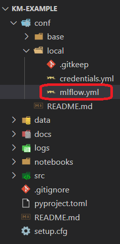

# First steps with the plugins
## Initialize kedro-mlflow
Run
```console
kedro mlflow init
```
You have the following message:
```console
'conf/base/mlflow.yml' successfully updated.
'run.py' successfully updated
```

The ``conf/base`` folder is updated:



If you have configured your own mlflow server, you can specify the tracking uri in the ``mlflow.yml`` (replace the highlighted line below:):


## Run the pipeline

Open a new command and launch
```console
kedro run
```

If the pipeline executes properly, you should see the following log:
```console
2020-07-13 21:29:24,939 - kedro.versioning.journal - WARNING - Unable to git describe path/to/km-example
2020-07-13 21:29:25,401 - kedro.io.data_catalog - INFO - Loading data from `example_iris_data` (CSVDataSet)...
2020-07-13 21:29:25,562 - kedro.io.data_catalog - INFO - Loading data from `params:example_test_data_ratio` (MemoryDataSet)...
2020-07-13 21:29:25,969 - kedro.pipeline.node - INFO - Running node: split_data([example_iris_data,params:example_test_data_ratio]) -> [example_test_x,example_test_y,example_train_x,example_train_y]
2020-07-13 21:29:26,053 - kedro.io.data_catalog - INFO - Saving data to `example_train_x` (MemoryDataSet)...
2020-07-13 21:29:26,368 - kedro.io.data_catalog - INFO - Saving data to `example_train_y` (MemoryDataSet)...
2020-07-13 21:29:26,484 - kedro.io.data_catalog - INFO - Saving data to `example_test_x` (MemoryDataSet)...
2020-07-13 21:29:26,486 - kedro.io.data_catalog - INFO - Saving data to `example_test_y` (MemoryDataSet)...
2020-07-13 21:29:26,610 - kedro.runner.sequential_runner - INFO - Completed 1 out of 4 tasks
2020-07-13 21:29:26,850 - kedro.io.data_catalog - INFO - Loading data from `example_train_x` (MemoryDataSet)...
2020-07-13 21:29:26,851 - kedro.io.data_catalog - INFO - Loading data from `example_train_y` (MemoryDataSet)...
2020-07-13 21:29:26,965 - kedro.io.data_catalog - INFO - Loading data from `parameters` (MemoryDataSet)...
2020-07-13 21:29:26,972 - kedro.pipeline.node - INFO - Running node: train_model([example_train_x,example_train_y,parameters]) -> [example_model]
2020-07-13 21:29:27,756 - kedro.io.data_catalog - INFO - Saving data to `example_model` (MemoryDataSet)...
2020-07-13 21:29:27,763 - kedro.runner.sequential_runner - INFO - Completed 2 out of 4 tasks
2020-07-13 21:29:28,141 - kedro.io.data_catalog - INFO - Loading data from `example_model` (MemoryDataSet)...
2020-07-13 21:29:28,161 - kedro.io.data_catalog - INFO - Loading data from `example_test_x` (MemoryDataSet)...
2020-07-13 21:29:28,670 - kedro.pipeline.node - INFO - Running node: predict([example_model,example_test_x]) -> [example_predictions]
2020-07-13 21:29:29,002 - kedro.io.data_catalog - INFO - Saving data to `example_predictions` (MemoryDataSet)...
2020-07-13 21:29:29,248 - kedro.runner.sequential_runner - INFO - Completed 3 out of 4 tasks
2020-07-13 21:29:29,433 - kedro.io.data_catalog - INFO - Loading data from `example_predictions` (MemoryDataSet)...
2020-07-13 21:29:29,730 - kedro.io.data_catalog - INFO - Loading data from `example_test_y` (MemoryDataSet)...
2020-07-13 21:29:29,911 - kedro.pipeline.node - INFO - Running node: report_accuracy([example_predictions,example_test_y]) -> None
2020-07-13 21:29:30,056 - km_example.pipelines.data_science.nodes - INFO - Model accuracy on test set: 100.00%
2020-07-13 21:29:30,214 - kedro.runner.sequential_runner - INFO - Completed 4 out of 4 tasks
2020-07-13 21:29:30,372 - kedro.runner.sequential_runner - INFO - Pipeline execution completed successfully.
```

Since we have kept the default value of the ``mlflow.yml``, the tracking uri (the place where runs are recorded) is a local ``mlruns`` folder which has just been created with the execution:


## Open the UI

Launch the ui:
```console
kedro mlflow ui
```

And open the following adress in your favorite browser

``http://localhost:5000/``


Click now on the last run executed, you will land on this page:


### Parameters versioning
Note that the parameters have been recorded *automagically*. Here, two parameters format are used:
1. The parameter ``example_test_data_ratio``, which is called in the ``pipeline.py`` file with the ``params:`` prefix
2. the dictionary of all parameters in ``parameters.yml`` which is a reserved key word in ``Kedro``. Note that **this is bad practice** because you cannot know which parameters are really used inside the function called. Another problem is that it can generate too long parameters names and lead to mlflow errors.

You can see that these are effectively the registered parameters in the pipeline with the ``kedro-viz`` plugin:

```console
pip install kedro-viz
kedro viz
```

Open your browser at the following adress:

```
http://localhost:4141/
```

You should see the following graph:


which indicates clearly which parameters are logged (in the red boxes with the "parameter" icon).

### Journal information

The informations provided by the ``Kedro``'s ``Journal`` are also recorded as ``tags`` in the mlflow ui in order to make reproducible. In particluar, the exact command used for running the pipeline and the kedro version used are stored.

### Artifacts

With this run, artifacts are empty. This is expected: mlflow does not know what it should log and it will not log all your data by default. However, you want to save your model (at least) or your run is likely useless!

First, open the ``catalog.yml`` file which should like this:


And persist the model as a pickle with the ``MlflowArtifactDataSet`` class:


Reopen the ui, select the last run and see that the file was uploaded:


This works for any type of file (including images with ``MatplotlibWriter``) and the UI even offers a preview for ``png`` and ``csv``, which is really convenient to compare runs.

*Note: Mlflow offers specific logging for machine learning models that should be better suited for your use case, but is not supported yet in ``kedro-mlflow==0.2.0``*
