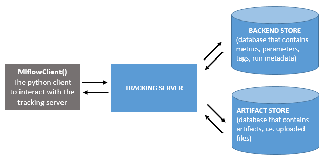

# Configure mlflow inside your project
## Context: mlflow tracking under the hood

Mlflow is composed of four modules which are described in the [introduction section](../01_introduction/01_introduction.md). The ain module is "tracking". The goal of this module is to keep track of every varying parameters across different code execution (parameters, metrics and artifacts). The following schema describes how this modules operates under the hood:



Basically, this schema shows that mlflow separates WHERE the artifacts are logged from HOW they are logged inside your code. You need to setup your mlflow tracking server separately from your code, and then each logging will send a request to the tracking server to store the elements you want to track in the appropriate location. The davatage of such a setup are numerous:
- once the mlflow tracking server is setup, there is songle paramter to set before logging which is the tracking server uri. This makes configuration very easy in your project.
- since the different storage locations are well identified, it is easy to define custom solutions for each of them. They can be [database or even local folders](https://mlflow.org/docs/latest/tracking.html#mlflow-tracking-servers).

The rationale behind the separation of the backend store and the artifacts store is that artifacts can be very big and are duplicated across runs, so they need a special management with extensible storage. This is typically [cloud storage like AWS S3 or Azure Blob storage](https://mlflow.org/docs/latest/tracking.html#id10).

## The ``mlflow.yml`` file
``kedro-mlflow`` needs the tracking uri of your mlflow tracking server to operate properly . The ``mlflow.yml`` file must have the ``mlflow_tracking_uri`` key with a [valid mlflow_tracking_uri associated ](https://mlflow.org/docs/latest/tracking.html#where-runs-are-recorded)value. The ``mlflow.yml`` default have this keys set to ``mlruns``. This will create a ``mlruns`` folder locally at the root of your kedro project and enable you to use the plugin without any setup of a mlflow tracking server.

```yaml
mlflow_tracking_uri: mlruns
```

This is the only mandatory key in the mlflow.yml file, but there are many others that provides fine-grained control on your mlflow setup. Please see the [``mlflow.yml`` description](../05_python_objects/05_Configuration.md) for further details.
