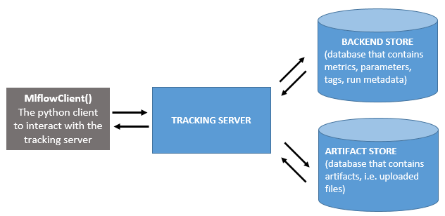

# Configure mlflow inside your project

We assume in this section that you have [installed `kedro-mlflow` in your virtual environment](../02_installation/01_installation.md) and you have [configured your project](../02_installation/02_setup.md) with a `mlflow.yml` configuration file and hooks declaration.

## Context: mlflow tracking under the hood

Mlflow is composed of four modules which are described in the [introduction section](../01_introduction/01_introduction.md). The main module is "tracking". The goal of this module is to keep track of every varying parameters across different code execution (parameters, metrics and artifacts). The following schema describes how this modules operates under the hood:



Basically, this schema shows that mlflow separates WHERE the artifacts are logged from HOW they are logged inside your code. You need to setup your mlflow tracking server separately from your code, and then each logging will send a request to the tracking server to store the elements you want to track in the appropriate location. The advantage of such a setup are numerous:

- once the mlflow tracking server is setup, there is single parameter to set before logging which is the tracking server uri. This makes configuration very easy in your project.
- since the different storage locations are well identified, it is easy to define custom solutions for each of them. They can be [database or even local folders](https://mlflow.org/docs/latest/tracking.html#mlflow-tracking-servers).

The rationale behind the separation of the backend store and the artifacts store is that artifacts can be very big and are duplicated across runs, so they need a special management with extensible storage. This is typically [cloud storage like AWS S3 or Azure Blob storage](https://mlflow.org/docs/latest/tracking.html#id10).

## The ``mlflow.yml`` file

The ``mlflow.yml`` file contains all configuration you can pass either to kedro or mlflow through the plugin. Note that you can duplicate `mlflow.yml` file in as many  environments (i.e. `conf/` folders) as you need. To create a ``mlflow.yml`` file in a kedro configuration environment, use ``kedro mlflow init --env=<your-env>``.

```{note}
If no ``mlflow.yml`` file is found in the environment, ``kedro-mlflow`` will still work and use all ``mlflow.yml`` default values as configuration.  
```

```{important}
If the kedro run is started in a process where a mlflow run is already active, ``kedro-mlflow`` will ignore all the configuration in ``mlflow.yml`` and use the active run. The mlflow run will NOT be closed at the end of the kedro run. This enable using ``kedro-mlflow`` with an orchestrator (e.g airflow, AzureML...) which starts the mlflow run and configuraiton itself.
```

### Configure the tracking server


#### Configure the tracking and registry uri

``kedro-mlflow`` needs the tracking uri of your mlflow tracking server to operate properly. The ``mlflow.yml`` file must have the ``mlflow_tracking_uri`` key with a [valid mlflow_tracking_uri associated](https://mlflow.org/docs/latest/tracking.html#where-runs-are-recorded) value. The ``mlflow.yml`` default have this keys set to ``null``. This means that it will look for a ``MLFLOW_TRACKING_URI`` environment variable, and if it is not set, it will create a ``mlruns`` folder locally at the root of your kedro project. This enables you to use the plugin without any setup of a mlflow tracking server.

Unlike mlflow, `kedro-mlflow` allows the `mlflow_tracking_uri` to be a relative path. It will convert it to an absolute uri automatically.

```yaml
server:
  mlflow_tracking_uri: mlruns
```

This is the **only mandatory key in the `mlflow.yml` file**, but there are many others described hereafter that provide fine-grained control on your mlflow setup.

You can also specify the registry uri:

```yaml
server:
  mlflow_registry_uri: registry.db
```

#### Configure the credentials

##### Default credentials with environment variables

You can also specify some environment variables needed by mlflow (e.g `AWS_ACCESS_KEY_ID` and `AWS_SECRET_ACCESS_KEY`) in the credentials and specify them in the `mlflow.yml`. Any key specified will be automatically exported as environment variables.

Your `credentials.yml` will look as follows:

```yaml
my_mlflow_credentials:
  AWS_ACCESS_KEY_ID: <your-key>
  AWS_SECRET_ACCESS_KEY: <your-secret-key>
```

and your can supply the credentials key of the `mlflow.yml`:

```yaml
server:
  credentials: my_mlflow_credentials
```

```{note}
For security reasons, the credentials will not be accessible within `KedroMlflowConfig` objects. They will be exported as environment variables *on the fly* when running the pipeline.
```

##### Authentication with expiring tokens

Mlflow can be deployed with OAuth2.0. authentication method : in this case, secured MLflow instances require HTTP requests to have the ``Authorization: Bearer <token>`` header. Mlflow exposes a [``RequestHeaderProvider`` abstract class](https://github.com/mlflow/mlflow/blob/master/mlflow/tracking/request_header/abstract_request_header_provider.py#L4) to mange this use case. If you need kedro-mlflow to use a *custom* header provider, you can configure your ``mlflow.yml`` as follow:  

```yaml
# mlflow.yml
server:
    request_header_provider:
        type: path.to.your.class.CustomRequestHeaderProvider
        pass_context: True # if you want to pass context. it must be named ``kedro_context`` in the ``__init__`` method of your custom ``request_header_provider``)
        init_kwargs:
            my_kwarg: 1
```

This will automatically register in the mlflow entrypoint the ``CustomRequestHeaderProvider(kedro_context=<kedro-context>, my_kwarg=1)`` request header when running a kedro pipeline.

### Deactivate tracking under conditions

`kedro-mlflow` logs every run parameters in mlflow. You may want to avoid tracking some runs (for instance while debugging to avoid polluting your mlflow database, or because some pipelines are not ml related and it does not makes sense to log their parameters).

You can specify the name of the pipelines you want to turn off:

```yaml
tracking:
  disable_tracking:
    pipelines:
      - <pipeline-name>
```

Notice that it will stop autologging parameters but also any `Mlflow<Artifact/Metrics/ModelLogger>Dataset` you may have in these deactivated pipelines.

### Configure mlflow experiment

Mlflow enable the user to create "experiments" to organize his work. The different experiments will be visible on the left panel of the mlflow user interface. You can create an experiment through the `mlflow.yml` file with the `experiment` key:

```yaml
tracking:
  experiment:
    name: <your-experiment-name>  # by default, the name of your python package in your kedro project
    restore_if_deleted: True  # if the experiment`name` was previously deleted experiment, should we restore it?
```

Note that by default, mlflow crashes if you try to start a run while you have not created the experiment first. `kedro-mlflow` has a `create` key (`True` by default) which forces the creation of the experiment if it does not exist. Set it to `False` to match mlflow default value.

### Configure the run

When you launch a new `kedro` run, `kedro-mlflow` instantiates an underlying `mlflow` run through the hooks. By default, we assume the user want to launch each kedro run in separated mlflow run to keep a one to one relationship between kedro runs and mlflow runs. However, one may need to *continue* an existing mlflow run (for instance, because you resume the kedro run from a later starting point of your pipeline).

The `mlflow.yml` accepts the following keys:

```yaml
tracking:
  run:
    id: null # if `id` is None, a new run will be created
    name: null # if `name` is None, pipeline name will be used for the run name
    nested: True  # # if `nested` is False, you won't be able to launch sub-runs inside your nodes
```

- If you want to continue to log in an existing mlflow run, write its id in the `id` key.
- If you want to enable the creation of sub runs inside your nodes (for instance, for model comparison or hyperparameter tuning), set the `nested` key to `True`

### Extra tracking configuration

You may sometimes encounter an mlflow failure "parameters too long". Mlflow has indeed an upper limit on the length of the parameters you can store in it. This is a very common pattern when you log a full dictionary in mlflow (e.g. the reserved keyword `parameters` in kedro, or a dictionnary conaining all the hyperparameters you want to tune for a given model). You can configure the `kedro-mlflow` hooks to overcome this limitation by "flattening" automatically dictionaries in a kedro run.

The `mlflow.yml` accepts the following keys:

```yaml
tracking:
  params:
    dict_params:
      flatten: False  # if True, parameter which are dictionary will be splitted in multiple parameters when logged in mlflow, one for each key.
      recursive: True  # Should the dictionary flattening be applied recursively (i.e for nested dictionaries)? Not use if `flatten_dict_params` is False.
      sep: "." # In case of recursive flattening, what separator should be used between the keys? E.g. {hyperaparam1: {p1:1, p2:2}} will be logged as hyperaparam1.p1 and hyperaparam1.p2 in mlflow.
    long_params_strategy: fail # One of ["fail", "tag", "truncate" ] If a parameter is above mlflow limit (currently 250), what should kedro-mlflow do? -> fail, set as a tag instead of a parameter, or truncate it to its 250 first letters?
```

If you set `flatten` to `True`, each key of the dictionary will be logged as a mlflow parameters, instead of a single parameter for the whole dictionary. Note that it is recommended to facilitate run comparison.

The `long_parameters_strategy` key enable to define different way to handle parameters over the mlflow limit (currently 250 characters):

- `fail`: no special management of characters above the limit. They will be send to mlflow and as a result, in some backend they will be stored normally ([e.g. for FileStore backend](https://github.com/mlflow/mlflow/issues/2814#issuecomment-628284425)) and for some others logging will fail.
- `truncate`: All parameters above the limit will be automatically truncated to a 250-character length to make sure logging will pass for all mlflow backend.
- `tag`: Any parameter above the limit will be registered as a tag instead of a parameter as it seems to be the [recommended mlflow way to deal with long parameters](https://github.com/mlflow/mlflow/issues/1976).

### Configure the user interface

You can configure mlflow user interface default params inside the `mlflow.yml`:

```yaml
ui:
  port: null  # the port to use for the ui. Find a free port if null.
  host: null  # the host to use for the ui. Default to "localhost" if null.
```

The port and host parameters set in this configuration will be used by default if you use `kedro mlflow ui` command (instead of `mlflow ui`) to open the user interface. Note that the `kedro mlflow ui` command will also use the `mlflow_tracking_uri` key set inside `mlflow.yml`.
