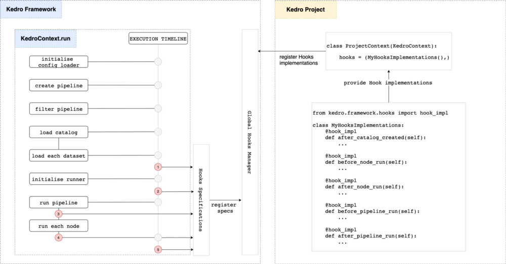

# Parameters versioning

## Automatic parameters versioning

Parameters versioning is automatic when the ``MlflowNodeHook`` is added to [the hook list of the ``ProjectContext``](https://kedro-mlflow.readthedocs.io/en/latest/source/02_installation/02_setup.html#declaring-kedro-mlflow-hooks). The `mlflow.yml` configuration file has a parameter called ``flatten_dict_params`` which enables to [log as distinct parameters the (key, value) pairs of a ```Dict`` parameter](../07_python_objects/02_Hooks.md).

You **do not need any additional configuration** to benefit from parameters versioning.

## How does ``MlflowNodeHook`` operates under the hood?

The [medium post which introduces hooks](https://medium.com/quantumblack/introducing-kedro-hooks-fd5bc4c03ff5) explains in detail the differents execution steps ``Kedro`` executes when the user calls the ``kedro run`` command.



The `MlflowNodeHook` registers the parameters before each node (entry point number 3 on above picture) by calling `mlflow.log_parameter(param_name, param_value)` on each parameters of the node.

## Frequently Asked Questions

### Will parameters be recorded if the pipeline fails during execution?

The parameters are registered node by node (and not in a single batch at the beginning of the execution). If the pipeline fails in the middle of its execution, the **parameters of the nodes who have been run will be recorded**, but **not the parameters of non executed nodes**.

### How are parameters detected by the plugin?

The hook **detects parameters through their prefix ``params:`` or the value ``parameters``**. These are the [reserved keywords used by Kedro to define parameters](https://kedro.readthedocs.io/en/stable/03_tutorial/04_create_pipelines.html?highlight=params%3A#working-with-multiple-pipelines) in the ``pipeline.py`` file(s).  

### How can I register a parameter if I use a ``TemplatedConfigLoader``?

If you [use a ``TemplatedConfigLoader``](https://kedro.readthedocs.io/en/latest/kedro_project_setup/configuration.html#templating-configuration) to enable dynamic parameters contruction at runtime or dependency between configuration files, and if we assume your ``src/<project-name>/run.py`` file looks like:

```python
from kedro.config import TemplatedConfigLoader  # new import
from datetime import date


class ProjectContext(KedroContext):
    def _create_config_loader(self, conf_paths: Iterable[str]) -> TemplatedConfigLoader:
        return TemplatedConfigLoader(
            conf_paths,
            globals_pattern="*globals.yml",  # read the globals dictionary from project config
            globals_dict={  # extra keys to add to the globals dictionary, take precedence over globals_pattern
                execution_date: date.today()
            },
        )
```

Then **you need to add this entry in your ``conf/<env>/parameters``** to ensure that the parameter will be properly recorded:

```yaml
execution_date: ${execution_date}
```
