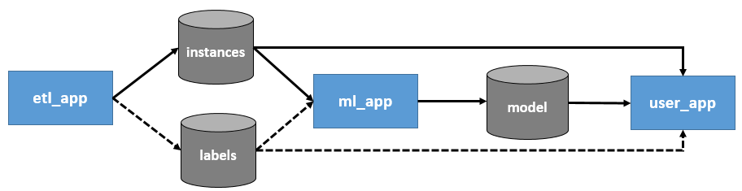

# The components of a machine learning application

## Definition: apps of a machine learning projects

A machine learning project is composed of 3 main blocks that I will call "apps" in the rest of the paragraph. These 3 apps are:

- The *etl_app*, which is the application in charge of bringing the data to the machine learning pipeline
- The *ml_app*, which is the application in charge of managing the machine learning model (including training and inference)
- The *user_app* which is the application in charge of consuming the predictions of the machine learning model and doing the actual business logic with it

## Difference between an app and a Kedro pipeline

Note that the previously defined "apps" are not pipelines in the Kedro sense. On the contrary, each app likely contain several (Kedro?) pipelines.  

The main differences between these apps are:

- Each app development / deployment  is likely under the responsibility of different people / teams.
- Each app has a different development lifecyle. It implies that development can be parallelized, and releasing one app to fix a bug does not imply to release the other ones. If your training pipeline is time /resources consuming, you do not want a bugfix in the *user_app* to trigger a retraining of your model, do you?
- Each app has its own orchestration timeline. For instance, the data produced by the etl can be stored independently of whether the *user_app* and the *ml_app* consume them "on the fly" or not.
- Each app do not communicate with the other apart from a clear interface: the data schema accepted as inputs/ output of each app.

## Apps development lifecycle in a machine learning project

### The data scientist creates at least part of the 3 apps

Note that there are **as many _etl_app_ and _user_app_** as needed for the different use of your model. Since **training the model is a specific use, the data scientist will need one to create its own _etl_app_ and _user_app_**. These apps will very likely be replaced later by the true business app dedicated to the model use.

We saw that the data scientist has to create some code that will be replaced by other people code when deploying the model. As a consequence, the interactions between these apps must be very clearly defined at the beginning of the project. We claim that it is possible to cover most use case with the following schema:

The *ml_app* takes `instances` (i.e. examples of the business object to handle) as input. This implies that the *ml_app* will include some machine learning-specific preprocessing and not only the model training. It also (optionally) takes labels as inputs if the underlying problem is supervised. Even in this situation, the labels will not be known at inference time so the *etl_app* does not necessarily produce them.

This is a key principle: anyone who wants to consume the model later will need to bring instances of the same business object.

### The *etl_app*

The *etl_app* is the one in charge of bringing the data to the *ml_app*. As a consequence, each different *user_app* will likely have to develop its associated *etl_app* to consume the *ml_app*.

From the data scientist point of view, this app will create the training dataset. This app can do very different things:

- send request over an API
- extract from a database (with SQL, SAS...)
- scrape data from a website
- download data from an URL
- read data from disk
- ...

For the labels, in addition of above possibility, this app can be a **labelling tool** with human labellers who provide the needed "true reference" as labels.

It is also common to mix several of above approaches to gather different data sources, and to have different Kedro pipelines in this app.

Note that during a training, this app very likely retrieves batch data from a given time period. This will necessarily be different when using the model, because the user often want to use live stream data.

### The *ml_app*

This app is the core of the data scientist work. It is at least composed of two kedro pipelines:

- a *training* pipeline, which produces all the artifacts (e.g. any object fitted on data, including obviously the machine learning model itself)
- an *inference* pipeline which takes an instance as input and returns the prediction of the model

It is quite common to have other pipelines depending on the data scientist needs (an *evaluation* pipelines which produces metrics for a given model, an *explanation* pipeline to produce explanation for a specific instance like shap values or importance pixel, ...).

It is quite common to see data scientists duplicate the code when creating the inference pipeline, because it is written after the training pipeline. **Thanks to kedro tags, it is possible to mark a node to use it in two different pipelines**. Reuse is a key component to improve quality and deployment speed. **Each time a node is created (i.e. a function is called), the data scientist should wonder if it will be used in *training* pipeline only or in both (*training* and *inference*), and tag it accordingly.**

### The *user_app*

The *user_app* must not be aware of how the inference pipeline operates under the hood. The *user_app* must either:

- takes a *run_id* from mlflow to retrieve the model from mlflow and predict with it. This is mainly useful for batch predictions.
- call the served model from an API endpoint and only get predictions as inputs. This assumes that the model has been served, which is very easy with mlflow.

After that, the *user_app* can use the predictions and apply any needed business logic to them.
