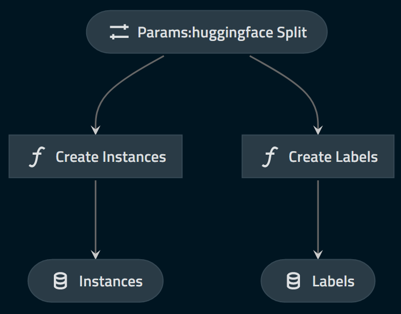

# Framework example

## Introduction

### Pre-requisite

This assumes the user is familiar with Kedro. We will refer to a `kedro>=0.16.5, <0.17.0` project template files (e.g. `catalog.yml`, `pipeline.py` and `hooks.py`).

### Disclaimer

**This is NOT a Kaggle competition. I will not try to create the best model (nor even a _good_ model)** to solve this problem. The goal of this tutorial is to demonstrate how the `pipeline_ml_factory` can help to maintain consistency between training and inference and prepare deployment.

The associated code can be found on github, under [kedro-mlflow-tutorial](https://github.com/Galileo-Galilei/kedro-mlflow-tutorial) repo.

### Introducing the task and dataset

We will use the [IMDB movie review](https://www.kaggle.com/lakshmi25npathi/imdb-dataset-of-50k-movie-reviews) dataset as an example. This dataset contains 50k movie reviews with associated "positive" or "negative" value manually labelled by a human.

We will train a classifier for binary classification to predict the sentiment associated to a movie review.

You can find [many notebooks on Kaggle](https://www.kaggle.com/lakshmi25npathi/imdb-dataset-of-50k-movie-reviews/notebooks) to learn more about this dataset.

## Building the project

To understand the division in *etl_app*, *ml_app* and *user_app*, you can refer to ["The components of a machine learning application"](./02_ml_project_components.md).

### The etl_app

We create a very basic `etl_app` for this example. It can be really complex in real life. What matters is that it is composed of two pipelines which produce `instances` and `labels` datasets.

The DAG looks like this:



Where the "huggingface_split" parameter is just here to define if we should produce "training" or "test" data. We persist the `instances` and `labels` in the DataCatalog for further reuse:

```yaml
# catalog.yml
#### ETL
instances:
  type: pickle.PickleDataSet
  filepath: data/01_raw/instances_${huggingface_split}.pkl

labels:
  type: pickle.PickleDataSet
  filepath: data/01_raw/labels_${huggingface_split}.pkl
```


### The ml_app

Once the instances and labels have been created with the *etl_app*, we can create and launch the machine learning training and inference pipelines. The inference pipeline is the one you will deploy for your end users.

#### A vanilla example: training a machine learning model

The most basic project we can imagine is the following: the business object "instances" is a numeric matrix, and we can directely train a model on it.

The entire pipeline is:

```python
# pipeline.py
def create_ml_pipeline_vanilla(**kwargs):
    """This pipeline is just an example to generate a kedro viz.
    It is NOT intended to be used directly.
    """

    return Pipeline(
        [
            node(
                func=train_model,
                inputs=dict(
                    data="instances", hyperparameters="params:xgb_hyperparameters",
                ),
                outputs="model",
                tags=["training"],
            ),
            node(
                func=predict_with_model,
                inputs=dict(model="model", data="instances"),
                outputs="predictions",
                tags=["inference"],
            ),
        ]
    )
```

with the associated graph:


You can **filter the pipeline to separate it between training and inference with efficient node reuse**.

| `pipeline.only_nodes_with_tags("training")`      | `pipeline.only_nodes_with_tags("inference")` |
| ----------- | ----------- |
| | |

Running the `training` pipeline will create the model, and if it is persisted in the `catalog.yml` file, you will be able to run the ``inference`` pipeline:

```yaml
# catalog.yml
model:
  type: pickle.PickleDataSet # anything other than a MemoryDataSet
  filepath: data/06_models/model.pkl # a local filepath
```

To make ``kedro-mlflow`` log your inference pipeline automatically after each `kedro run --pipeline=training` command, declare your pipeline as a ``PipelineML`` object in your ``hooks.py``:

```python
# hooks.py
class ProjectHooks:
    @hook_impl
    def register_pipelines(self) -> Dict[str, Pipeline]:
        pipeline_training = pipeline_ml_factory(
            training=ml_pipeline.only_nodes_with_tags("training"),
            inference=ml_pipeline.only_nodes_with_tags("inference"),
            input_name="instances",
        )
        return {
            "training": pipeline_training,
            "__default__": pipeline_training
        }
```

> This example is nice, but not realistic. It is extremely rare to train a model directly on raw data. It would be convenient to be able to add a preprocessing node, wouldn't it ? This is the purpose of the next session.

#### Sharing preprocessing: text cleaning example

Assume you want to add an extra preprocessing node before training the model. The previous entire DAG would look like this:

|


You can once again filter this huge pipeline to separate it between `training` and `inference`. **Since you do not duplicate nodes, this ensure consistency because you are absolutely sure you call the exact same functions** in the two pipelines.

| `pipeline.only_nodes_with_tags("training")`      | `pipeline.only_nodes_with_tags("inference")` |
| ----------- | ----------- |
| | |

You want to serve the entire inference pipeline (extra preprocessing included) to your end users, and this is exactly what we are going to do here!

**You do not need to update your ``hooks.py`` file: the declaration made in previous paragraph will log your entire inference pipeline (preprocessing included) after each ``kedro run --pipeline=training`` command.**

> Wait! In real life, it is often more complex: preprocessing is often not declared manually through a function but also fitted on data. For instance, you can fit an imputer, a tokenizer, an encoder... and reuse them in the inference pipeline. We need a way to persist these objects.

#### Reusing fitted objects: the example of a tokenizer

Before sending data to the model, we need to convert it in a numerical format. For this example, we assume that we use the keras tokenizer, and its default method ``texts_to_matrix`` which encodes a list of tokens to a matrix where each columns represents a word in a fixed-sized vocabulary. This methods is known as "bag of words", and is a simple yet quite efficient way to convert text to numeric (but it lost relative position of words in a sentence, and much better way exist for such conversion, like embeddings).

We add 2 nodes in our ml pipeline:

- a ``fit_tokenizer`` node, which will be used only during training. The node has "training" tag.
- a ``tokenize_text`` node, which will be used both in training and inference. The node has ["training", "inference"] tags.

| `pipeline.only_nodes_with_tags("training")`      | `pipeline.only_nodes_with_tags("inference")` |
| ----------- | ----------- |
| | |

In order to enable ``kedro-mlflow`` to log these stopwords as artifacts and reuse them during inference, we need to persist the locally:

```yaml
# catalog.yml
tokenizer:
  type: pickle.PickleDataSet # anything other than a MemoryDataSet
  filepath: data/06_models/tokenizer.pkl # a local filepath
```

**Since our ``training`` pipeline is a `PipelineML` object created by `pipeline_ml_factory` function, `kedro-mlflow` will automatically resolve the dependencies between ``training`` and ``inference`` pipelines and will log the tokenizer as an artifact of our model.** It will be then automatically reused when predicting with the model. Nice, isn't it?

> Wait! This is great, but we sometimes also need to reuse some parameters or shared inputs between my inference pipeline. For instance, my preprocessing function has a list of stopwords, and I need to use the same stopwords during inference.

#### Reusing shared inputs: the example of stopwords

Let's add an extra node during our preprocessing with ``["training", "inference"]`` tags which removes stopwords.

| `pipeline.only_nodes_with_tags("training")`      | `pipeline.only_nodes_with_tags("inference")` |
| ----------- | ----------- |
| | |

Like every reusable artifacts, we need to persist these stopwords to make ``kedro-mlflow`` able to reuse them later:

```yaml
# catalog.yml
en_stopwords:
  type: yaml.YAMLDataSet # anything other than a MemoryDataSet
  filepath: data/01_raw/stopwords.yml # a local filepath
```

> This is nice! We are able to create a complex inference pipeline which is always synchronized with the training pipeline. However, we sometimes need to add some extra operations to validate / evaluate the model during training, and these operations are not related to inference. Is it possible? Sure!

#### Adding some metrics and monitoring

Say that before training your model, you to split it between train and test (e.g. to early stop on test), and then calculate some metrics on this test data (note that it will never replace using a real validation dataset to estimate the real performance of your model).

You can add some nodes which are completely unrelated to your ``inference`` pipeline in your ``training`` pipeline.

#### Labels post processing

#### Final result:

### The user_app

Use `MlflowModelLoggerDataset` to force reading from a given run_id.
